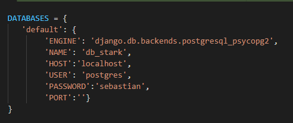
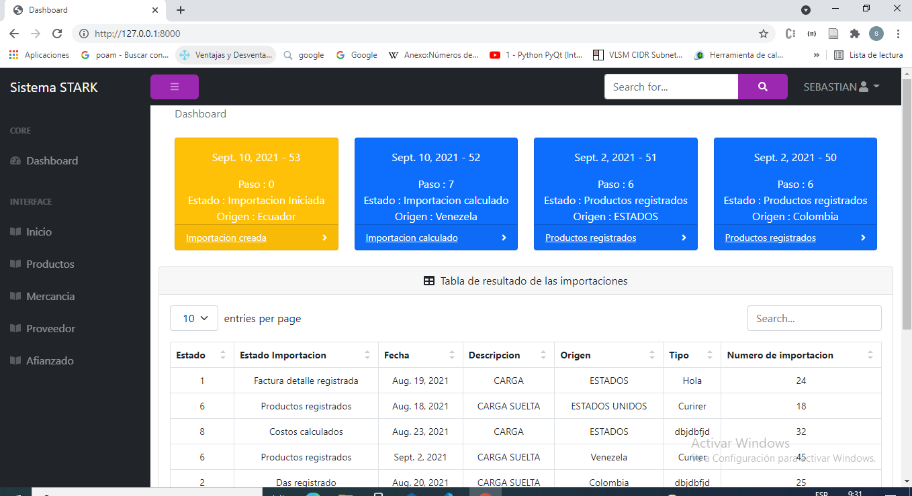

# Sistema stark

UNIVERSIDAD POLITECNICA SALESIANA

                    
  CARRERA COMPUTACIÓN 

                     
 PROYECTO TÉCNICO

 Autores: Carla Guamanzara, Sebastian Guandinango

  Informe de técnico del para la implementación del sistema 

1) Una vez clonado el repositorio realizar la instalación de las siguientes librerias:

    - pip install django-import-export
    - pip install numpy
    - pip install django_excel 
    - pip install psycopg2-binary
    - pip install woocommerce

2) Configurar las credenciales para el acceso a la base de datos en el archivo settings.py 

 

3) Vefificar que la aplicación este ejecutandose corrrectamnete con el siguinete comando:

    - python manage.py runserver

4) Si se ejecuta correctamente procedemos a detener con las teclas ctrl + c, para crear las tablas dentro de db ejecutamos los siguientes comandos:

    - python manage.py makemigrations
    - python manage.py migrate    

5) Luego de haber cargado las tablas correctamente, para poder acceder al sitio de administracion creamos un super usuario con el siguiente comando:

    - python manage.py createsuperuser  

6) Una vez finalizada con los pasos anteriores volvemos a correr la aplicación el cual pedirá su usario y contraseña creada en el paso 5, el cual al ingresar se muestra la siguiente pantalla.

 

7) Una vez dentro ya podemos acceder a sitio de adminstracion de django dando click en el usuario y selecionando la opción de admisntracion o directamente colocando la dirección http://localhost:8000/admin/ en el navegador, se visualiza de la siguiente manera.

 

8) Para poder realizar todo el proceso de calculo del nuevo costo y del nuevo inventario se debe cambiar la configuración de las credenciales del api-rest en el archivo woo_commerce.py, para que pueda acceder a los datos de su tienda.

 

9) Dentro del proceso de la importación se maneja 10 estados que se detallan acontinuación. 

## Estados de la importación

    - '#' Descripción 
    - 0   Importación Iniciada                                
    - 1   Factura detalle registrada
    - 2   Das registrado
    - 3   Detalle Das registrada
    - 4   Factura afianzado registrado
    - 5   Detalle afianzado registrado
    - 6   Productos agregados en la importación
    - 7   Datos calculados
    - 8   Nuevo costo y cantidad calculados
    - 9   Productos actualizados

## 

